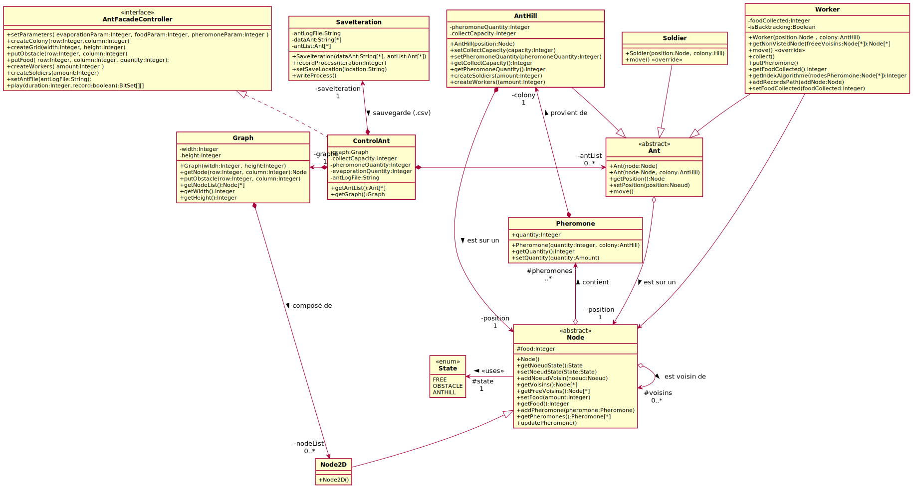

# A22-Fourmis

Projet consistant à utiliser nos compétence en A22 (Modélisation orientée objet à l'aide de UML) et P21 (Programmation orientée objet) lors de notre deuxième semestre en première année d'IUT.

**La première partie a été de conceptionner une conception d'une colonie de fourmis en UML puis ensuite de programmer notre conception en JAVA.**

Les algorithmes de colonie de fourmis sont utilisés pour résoudre des problèmes d’optimisation dans des
graphes. On se propose ici de modéliser les déplacements d’une colonie de fourmis sur un graphe particulier :
une grille rectangulaire.

Ce projet à étais réaliser par : Alexander Yanovskyy et Eren Mustafa Ceylan.

# [Lien pour le sujet](https://cdn.discordapp.com/attachments/801466518843555864/834023140094378014/projet2021.pdf)

# Images de conception UML 

